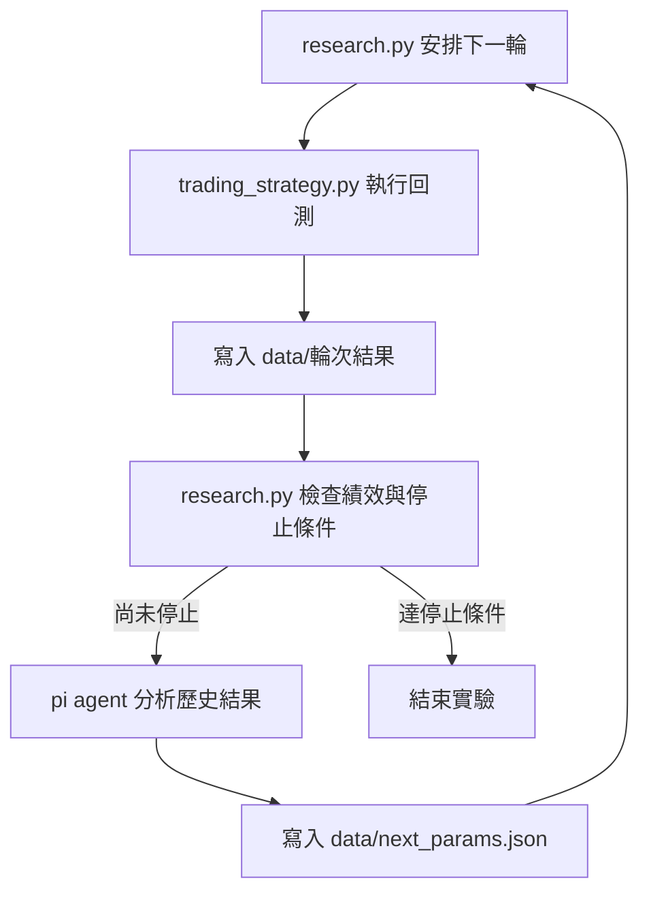
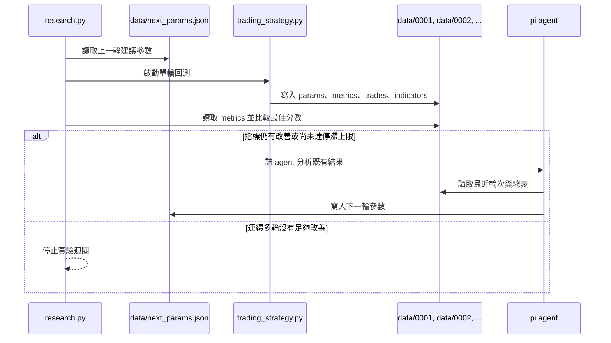
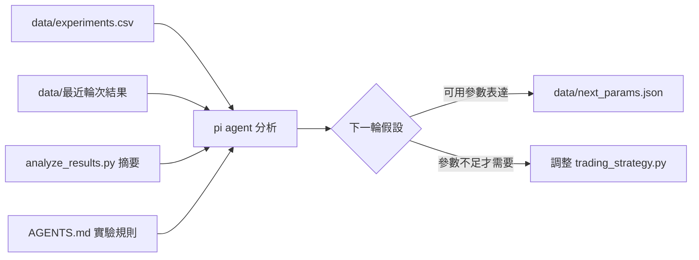

# 實驗流程說明

這份文件專注說明自動實驗流程，以及 `research.py`、`trading_strategy.py`、pi agent 和 `data/` 目錄之間的分工。

## 整體架構

`research.py` 是流程控制器，負責一輪一輪安排回測、判斷是否停止，以及在需要下一組參數時呼叫 pi agent。`trading_strategy.py` 只負責根據輸入參數完成單輪策略回測；pi agent 則只負責讀取歷史結果、提出下一輪參數。

## 單輪實驗生命週期

每一輪實驗都從 `research.py` 取得下一個輪次開始。若 `data/next_params.json` 已存在，`research.py` 會把它視為本輪候選策略參數，交給 `trading_strategy.py` 執行。回測完成後，本輪的參數、交易紀錄、逐日指標與績效指標會寫入新的輪次資料夾，總表也會同步更新。

## pi agent 用在那些地方

pi agent 不負責跑回測，也不直接判定本輪分數是否達到停止條件。它的工作集中在「看完結果後，決定下一輪要測什麼」。

pi agent 主要使用在三個位置：

1. 讀取歷史實驗結果：比較 `data/experiments.csv` 與最近幾輪的 `summary.txt`、`params.json`、`metrics.json`、`trades.csv`。
2. 分析策略表現：透過 `analyze_results.py` 摘要年化報酬、最大跌幅、Sharpe、交易次數、曝險與最大回撤附近狀態。
3. 產生下一輪參數：依照 `AGENTS.md` 的規則，一次只調整一個小方向，最後寫入 `data/next_params.json`。

## 資料檔案如何串起流程

- `data/<四位數輪次>/params.json`：記錄本輪實際使用的策略參數，方便追溯某個結果是怎麼跑出來的。
- `data/<四位數輪次>/metrics.json`：提供 `research.py` 判斷分數是否改善，也提供 pi agent 比較不同輪次。
- `data/<四位數輪次>/trades.csv`：讓 pi agent 檢查交易是否過度頻繁，或是否集中在特定年份。
- `data/<四位數輪次>/indicators.csv`：保留逐日訊號、曝險、報酬與 equity curve，需要細查回撤或訊號失效時使用。
- `data/experiments.csv`：所有輪次的總表，是比較參數與績效關係的主要資料來源。
- `data/next_params.json`：pi agent 與下一輪回測之間的交接檔；它只描述下一輪策略參數，不描述流程參數。

## 停止條件

`research.py` 會持續追蹤指定績效指標的最佳值。若本輪分數沒有比既有最佳值多出足夠改善幅度，就會累計一次停滯；停滯次數達到上限時，實驗迴圈結束。這個停止條件由 `research.py` 控制，pi agent 只在尚未停止時提供下一輪參數建議。