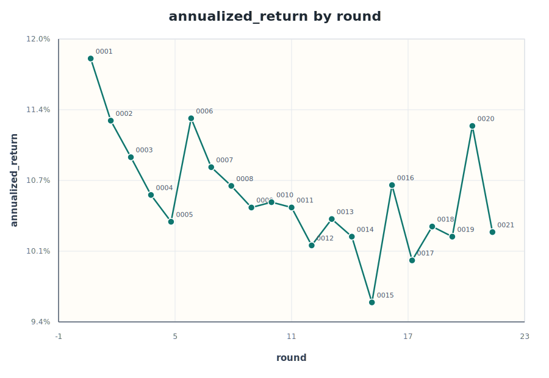
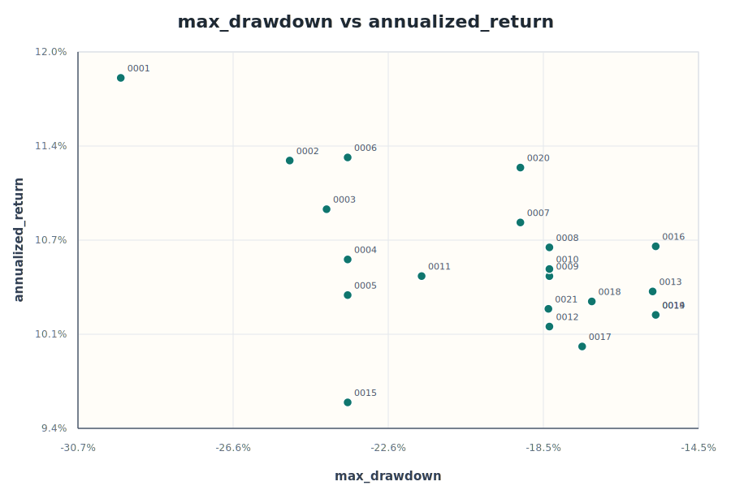
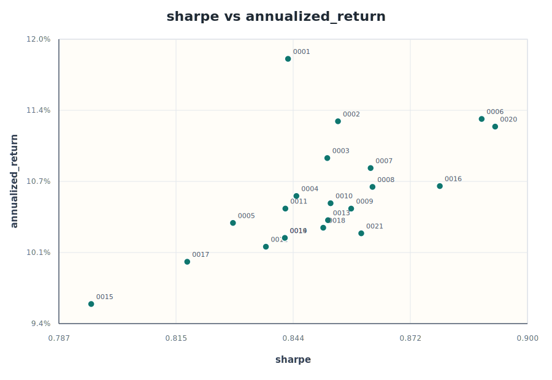
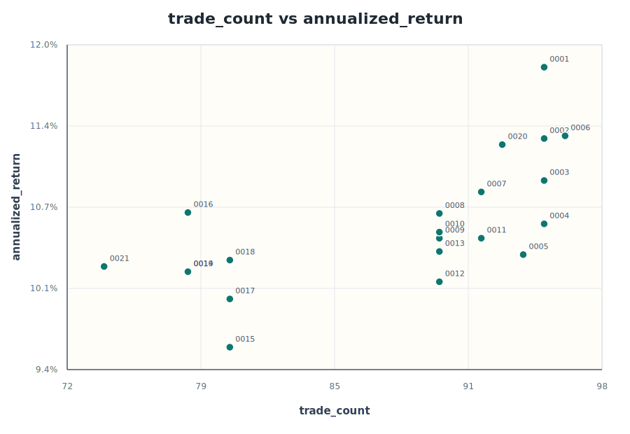

# 21 輪回測觀察

資料來源：[experiments.csv](experiments.csv)。本輪分析涵蓋 `0001` 到 `0021` 共 21 次實驗，期間固定標的與回測區間，主要調整移動平均、動能期數、低訊號曝險與高波動扣減幅度。

## 圖表

## 主要結論

年化報酬確實從前幾輪高點往下走，但這不是單純策略變差，而是參數搜尋逐步把策略推向更保守的曝險設定。第 `0001` 輪年化報酬最高，達 `11.84%`，但最大回撤也最深，為 `-29.56%`。後續提高 `vol_cut`、降低 `low_weight` 之後，年化報酬多數落在 `10%` 到 `11%` 區間，但最大回撤明顯改善到約 `-15%` 到 `-19%`。

目前綜合分數最佳的是第 `0016` 輪：`ma_months=10`、`momentum_months=7`、`low_weight=0.0`、`vol_cut=0.7`。它的年化報酬是 `10.67%`，低於第 `0001` 輪，但最大回撤改善到 `-15.59%`，Sharpe 達 `0.879`，交易次數也降到 `78`。這代表第 `0016` 輪是目前較好的風險控制版本。

若只看 Sharpe，第 `0020` 輪最突出：`ma_months=10`、`momentum_months=7`、`low_weight=0.3`、`vol_cut=0.6`，年化報酬 `11.22%`，Sharpe `0.893`，但最大回撤回到 `-19.12%`，交易次數也升到 `93`。它是目前比較接近「拿回報酬，但仍比早期低回撤」的折衷版本。

## 參數取捨

- `vol_cut` 和年化報酬呈明顯負相關，相關係數約 `-0.78`。高波動時扣曝險越重，風險越低，但報酬也越容易被壓低。
- 平均曝險和年化報酬高度正相關，相關係數約 `0.89`。這表示年化報酬下降的主要原因是曝險降低，而不是訊號完全失效。
- `low_weight` 從 `0.3` 降到 `0.0` 後，最大回撤改善明顯，但年化報酬也同步下降。這個參數控制「趨勢與動能都不成立時是否仍保留底倉」，是報酬與防守之間的核心槓桿。
- 交易次數與年化報酬呈正相關，約 `0.65`。較保守版本降低交易次數，但也可能錯過重新進場與恢復曝險的機會。

## 候選基準

| 角色 | 輪次 | 參數重點 | 年化報酬 | 最大回撤 | Sharpe | 交易次數 | 解讀 |
| --- | --- | --- | ---: | ---: | ---: | ---: | --- |
| 高報酬基準 | `0001` | `vol_cut=0.2`, `low_weight=0.3`, `momentum_months=12` | `11.84%` | `-29.56%` | `0.842` | `95` | 報酬最高，但風險過高。 |
| 風險控制最佳 | `0016` | `vol_cut=0.7`, `low_weight=0.0`, `momentum_months=7` | `10.67%` | `-15.59%` | `0.879` | `78` | 綜合分數最佳，回撤控制最乾淨。 |
| 報酬折衷候選 | `0020` | `vol_cut=0.6`, `low_weight=0.3`, `momentum_months=7` | `11.22%` | `-19.12%` | `0.893` | `93` | Sharpe 最佳，報酬回升，但曝險與交易次數較高。 |
| 低交易版本 | `0021` | `vol_cut=0.8`, `low_weight=0.0`, `ma_months=12` | `10.24%` | `-18.39%` | `0.860` | `74` | 交易最少，但報酬沒有補償額外保守度。 |

## 下一輪方向

若目標是改善「年化報酬越來越低」這件事，建議不要直接回到第 `0001` 輪那種高曝險設定。比較穩的下一輪假設是從第 `0016` 輪出發，只把 `vol_cut` 從 `0.7` 降到 `0.6`，`low_weight` 先維持 `0.0`。這可以測試降低高波動扣減是否能拿回部分報酬，同時避免直接恢復底倉造成回撤擴大。

若下一輪年化報酬仍沒有改善，優先檢查高波動期間是否太頻繁降低曝險，以及 `momentum_months=7` 是否只是在特定年份有效。若年化改善但回撤明顯惡化，再考慮把 `low_weight` 維持在 `0.0`，只微調 `vol_cut` 或波動門檻，而不要同時放寬多個風險參數。
