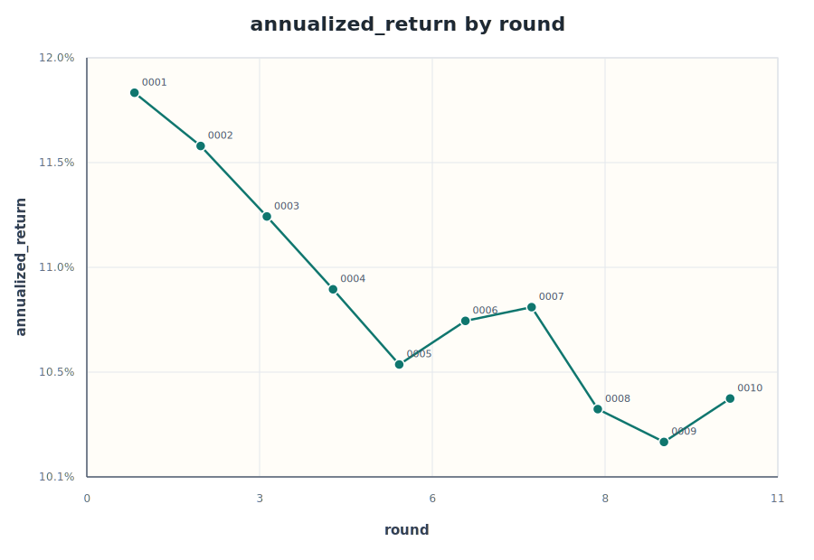
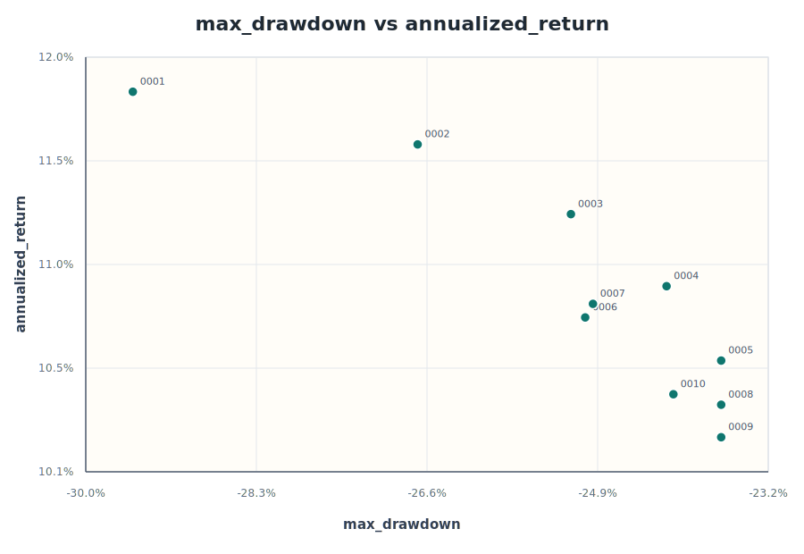
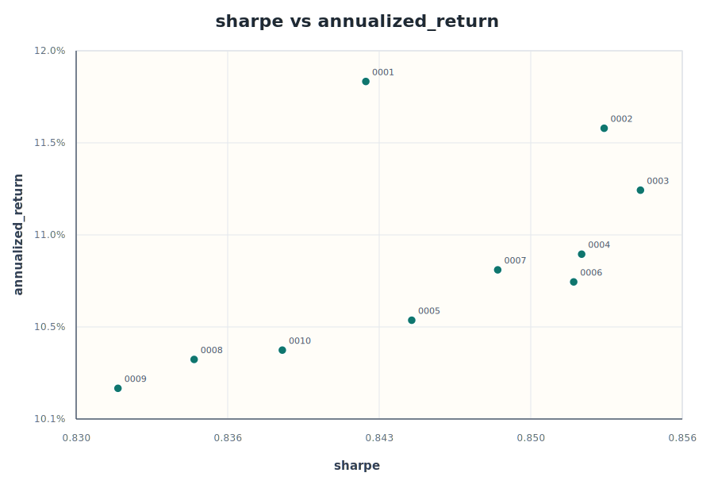
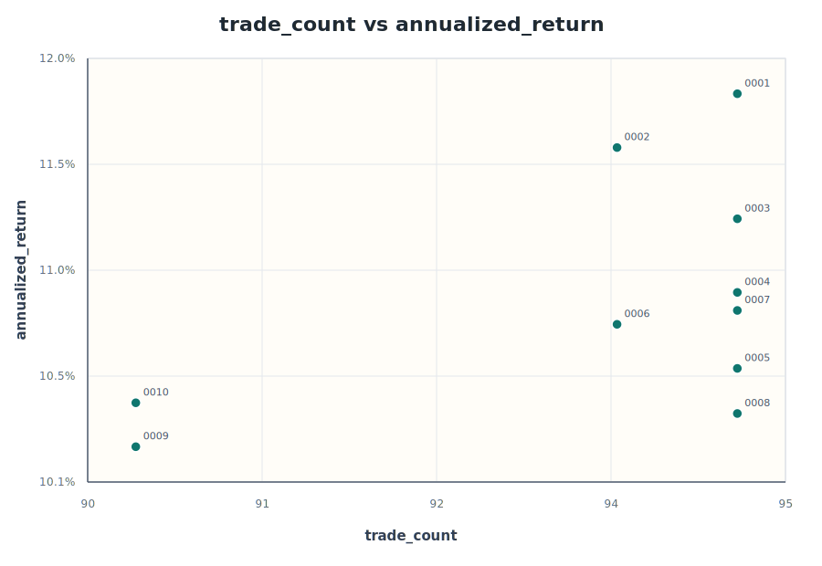

# 10 輪回測觀察

資料來源：[experiments.csv](experiments.csv)。本輪分析涵蓋 `0001` 到 `0010` 共 10 次實驗，期間固定標的與回測區間，主要測試 `vol_cut`、`low_weight` 與 `mid_weight` 對報酬、回撤、曝險與交易次數的影響。

## 圖表

## 主要結論

第 `0001` 輪仍是報酬最高版本：年化報酬 `11.84%`、總報酬約 `10.51x`，但最大回撤也最深，達 `-29.56%`。把 `vol_cut` 從 `0.2` 一路提高到 `0.6` 後，回撤改善到約 `-23.63%`，但年化報酬同步降到 `10.58%`，顯示這批實驗主要是在用曝險換取風險控制。

若看風險調整後表現，第 `0003` 輪 Sharpe 最高，為 `0.855`，年化報酬仍有 `11.26%`，最大回撤降到 `-25.15%`。它比第 `0001` 輪少了約 `0.58pp` 年化報酬，但回撤改善約 `4.41pp`，是目前較好的報酬與風險折衷。

綜合分數最佳的是第 `0009` 輪：`vol_cut=0.7`、`low_weight=0.3`、`mid_weight=0.7`。它的最大回撤與第 `0005`、`0008` 輪同為 `-23.63%`，交易次數降到 `90`，但年化報酬只剩 `10.22%`。這代表分數改善主要來自更低曝險與更少交易，不是報酬本身變強。

最新第 `0010` 輪把 `low_weight` 從 `0.3` 提高到 `0.4`，年化報酬從第 `0009` 輪的 `10.22%` 回升到 `10.42%`，平均曝險從 `0.620` 升到 `0.628`，交易次數維持 `90`，但最大回撤退到 `-24.12%`。這個方向能拿回一點報酬，但目前補償不大。

## 參數取捨

- `vol_cut` 與年化報酬呈強烈負相關，相關係數約 `-0.97`。扣曝險越重，回撤改善，但報酬下滑很明顯。
- 平均曝險與年化報酬高度正相關，相關係數約 `0.99`。這批結果的報酬差異幾乎都來自曝險高低。
- 交易次數與年化報酬呈中度正相關，約 `0.51`。第 `0009`、`0010` 輪把交易次數降到 `90`，但也落在報酬較低區間。
- 單獨提高 `low_weight` 到 `0.4` 可以回補報酬，但第 `0006` 與第 `0010` 都伴隨最大回撤變深，表示底倉不是免費午餐。
- 單獨提高 `mid_weight` 到 `0.8` 的第 `0007` 年化報酬 `10.84%`，略高於同 `vol_cut=0.6` 的第 `0005`，但最大回撤也從 `-23.63%` 退到 `-24.93%`。

## 候選基準

| 角色 | 輪次 | 參數重點 | 年化報酬 | 最大回撤 | Sharpe | 交易次數 | 解讀 |
| --- | --- | --- | ---: | ---: | ---: | ---: | --- |
| 高報酬基準 | `0001` | `vol_cut=0.2`, `low_weight=0.3`, `mid_weight=0.7` | `11.84%` | `-29.56%` | `0.842` | `95` | 報酬最高，但金融海嘯回撤太深。 |
| Sharpe 最佳 | `0003` | `vol_cut=0.4`, `low_weight=0.3`, `mid_weight=0.7` | `11.26%` | `-25.15%` | `0.855` | `95` | 報酬仍高，回撤比起點明顯改善。 |
| 回撤控制候選 | `0005` | `vol_cut=0.6`, `low_weight=0.3`, `mid_weight=0.7` | `10.58%` | `-23.63%` | `0.844` | `95` | 回撤改善最多的一批中，報酬相對較高。 |
| 綜合分數最佳 | `0009` | `vol_cut=0.7`, `low_weight=0.3`, `mid_weight=0.7` | `10.22%` | `-23.63%` | `0.832` | `90` | 交易較少，但報酬被壓得偏低。 |
| 最新放寬底倉 | `0010` | `vol_cut=0.7`, `low_weight=0.4`, `mid_weight=0.7` | `10.42%` | `-24.12%` | `0.839` | `90` | 小幅恢復報酬，但回撤同步惡化。 |

## 下一輪方向

若目標仍是優先提高或恢復報酬，建議不要繼續往更高 `vol_cut` 測；這條線已經很清楚是在降低曝險、壓低報酬。較合理的基準是第 `0003` 輪或第 `0005` 輪：第 `0003` 輪保留較高報酬與最佳 Sharpe，第 `0005` 輪則代表目前可接受的回撤控制。

下一輪可以從第 `0005` 輪出發，只把 `vol_cut` 從 `0.6` 降到 `0.5` 或回到第 `0003` 輪的 `0.4` 附近重新確認報酬/回撤斜率；不要同時提高 `low_weight` 或 `mid_weight`。若下一輪報酬回升且最大回撤仍低於約 `-25%`，再考慮細測底倉；若回撤立刻退回 `-26%` 以上，就代表 `vol_cut=0.6` 可能是這批參數裡比較實用的風險邊界。
