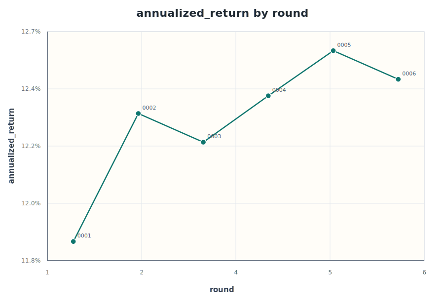
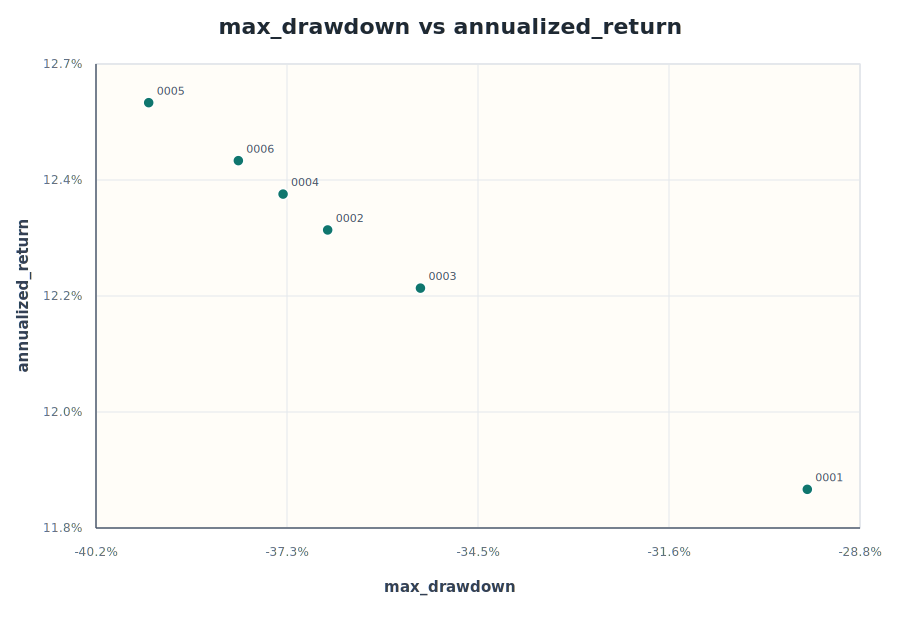
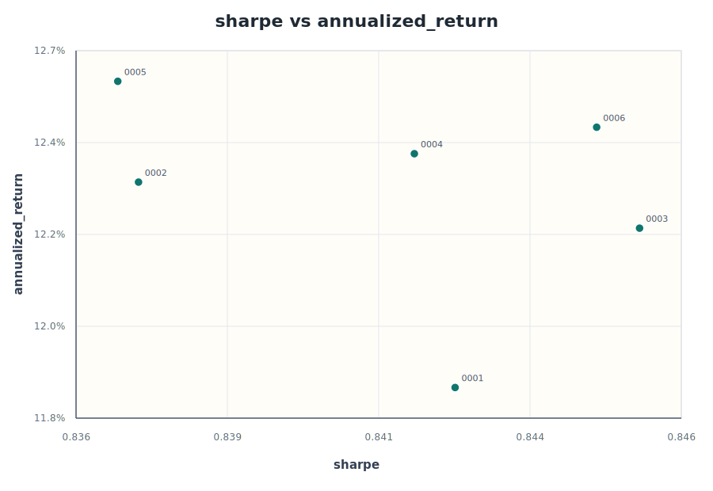
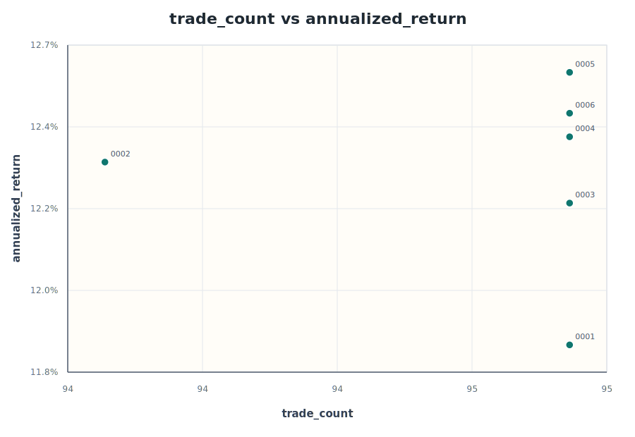

# 6 輪回測觀察

資料來源：[experiments.csv](experiments.csv)。本輪分析涵蓋 `0001` 到 `0006` 共 6 次實驗，期間固定標的與回測區間，主要測試提高 `mid_weight`、`low_weight` 與微調 `vol_cut` 後，報酬是否能補償更高曝險與更深回撤。

## 圖表

## 主要結論

第 `0005` 輪是目前報酬最高版本：`mid_weight=0.9`、`low_weight=0.6`、`vol_cut=0.25`，年化報酬達 `12.58%`，總報酬約 `12.30x`。但最大回撤也同步惡化到 `-39.42%`，比基準第 `0001` 輪深約 `9.86pp`，顯示這次報酬提升主要來自更高曝險。

第 `0006` 輪在第 `0005` 輪基礎上把 `vol_cut` 從 `0.25` 提高到 `0.3`，年化報酬小降到 `12.47%`，最大回撤改善到 `-38.08%`，Sharpe 回到 `0.845`。這代表提高 `vol_cut` 可以稍微修回風險，但目前幅度不足以把回撤拉回可接受區間。

若看風險調整後表現，第 `0003` 與第 `0006` 的 Sharpe 並列接近最佳，約 `0.845`。第 `0003` 的年化報酬 `12.22%`，最大回撤 `-35.35%`；第 `0006` 報酬較高，但回撤更深。若不接受接近 `-40%` 的回撤，第 `0003` 是比較乾淨的折衷點。

綜合分數仍由第 `0001` 輪最佳，因為後續加曝險雖然提高報酬，最大回撤卻惡化更快。第 `0002` 到第 `0005` 的年化報酬一路提高，但 composite_score 持續變差，說明這批實驗是在用大量下檔風險換小幅年化增益。

## 參數取捨

- `low_weight` 與年化報酬高度正相關，相關係數約 `0.98`；`mid_weight` 也約 `0.96`。提高中低訊號曝險確實能推升報酬。
- 平均曝險與年化報酬相關係數約 `0.99`。這批結果幾乎就是曝險越高，報酬越高。
- 最大回撤也隨曝險上升明顯惡化：第 `0001` 的 `-29.56%` 到第 `0005` 的 `-39.42%`，報酬多 `0.74pp`，回撤卻深近 `10pp`。
- `vol_cut` 從 `0.25` 提到 `0.3` 的第 `0006`，讓回撤比第 `0005` 改善 `1.34pp`，但年化只少 `0.11pp`，這個方向比繼續加權重更值得延續。
- 交易次數幾乎固定在 `94` 到 `95`，所以本輪差異不是來自換倉頻率，而是持倉曝險大小。

## 候選基準

| 角色 | 輪次 | 參數重點 | 年化報酬 | 最大回撤 | Sharpe | 交易次數 | 解讀 |
| --- | --- | --- | ---: | ---: | ---: | ---: | --- |
| 風險基準 | `0001` | `vol_cut=0.2`, `low_weight=0.3`, `mid_weight=0.7` | `11.84%` | `-29.56%` | `0.842` | `95` | 分數最佳，但報酬已不是最高。 |
| 較佳折衷 | `0003` | `vol_cut=0.25`, `low_weight=0.5`, `mid_weight=0.8` | `12.22%` | `-35.35%` | `0.845` | `95` | 報酬提高，回撤尚未接近最差。 |
| 報酬最高 | `0005` | `vol_cut=0.25`, `low_weight=0.6`, `mid_weight=0.9` | `12.58%` | `-39.42%` | `0.837` | `95` | 報酬高點，但回撤失控。 |
| 最新風險修正 | `0006` | `vol_cut=0.3`, `low_weight=0.6`, `mid_weight=0.9` | `12.47%` | `-38.08%` | `0.845` | `95` | 提高 `vol_cut` 有效，但還不夠。 |

## 下一輪方向

這批實驗已經證明提高 `mid_weight` 與 `low_weight` 可以拉高年化報酬，但第 `0005` 的回撤代價太大，不適合繼續單純加曝險。下一輪不應再提高 `low_weight` 或 `mid_weight`；比較合理的是從第 `0006` 輪出發，只把 `vol_cut` 小幅提高到 `0.35`，測試是否能繼續降低 2008 年回撤，同時保留 `12%` 以上年化報酬。

若第 `0007` 類似設定能把最大回撤壓回 `-36%` 附近且年化仍高於第 `0003`，就值得沿著 `vol_cut` 繼續細測。若報酬掉回 `12.2%` 以下，則第 `0003` 可能是本批參數裡較好的折衷基準。
